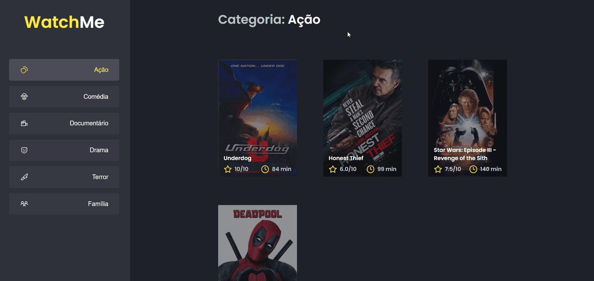

<h1 align="center">
  
</h1>

<p align="center">
 <a href="#sobre-o-projeto">Sobre o Projeto</a> •
 <a href="#tecnologias">Tecnologias</a> •
 <a href="#configurações-necessárias">Configurações necessárias</a>
</p>

## Sobre o projeto

Nesse desafio deverá performar uma aplicação React utilizando das ferramentas e dicas aprendidas durante o módulo **Performando apps com ReactJS**.

Se você fez o desafio opcional [Componentizando a aplicação](https://www.notion.so/b9f0f025c95b437699d0c3115f55b0f1) deve lembrar que se trata de uma aplicação que exibe uma listagem de filmes por categoria com base na categoria selecionada e que esses dados vem de uma API (fake API com JSON Server).

O projeto foi desenvolvido como desafio das aulas do Chapter V [Ignite da Rocketseat](https://rocketseat.com.br/)

Link do >> [Desafio](https://www.notion.so/Desafio-01-Otimizando-a-aplica-o-2942004b422d455891756300d88d0b9a)

---

## Tecnologias

Abaixo as tecnologias utilizadas para construção da aplicação

- [ReactJS](https://reactjs.org/)
- [Sass](https://sass-lang.comcom)
- [Axios](https://axios-http.com/ptbr/docs/intro)
- [TypeScript](https://www.typescriptlang.org)
- [JSON Server](https://www.npmjs.com/package/json-serverhttps://fauna.com)

---

## Configurações necessárias

### **Requisitos**

Necessário realizar as instalações:

- [Git](https://git-scm.com/)
- [Yarn](https://classic.yarnpkg.com)


### **Clone do projeto**

```bash
# Execute o comando git clone para realizar o clone do repositório
$ git clone https://github.com/diogomfc/desafio-otimizando-a-aplicacao.git
# Entre na pasta do repositório clonado
$ cd desafio-otimizando-a-aplicacao
```

### **Iniciando o projeto**

```bash
# Execute yarn para instalar as dependências
$ yarn

# Na raiz do projeto crie uma copia do arquivo .env.local.example
# Altere o nome da copia para .env.local
# Preencha as variáveis ambiente de acordo com as instruções
$ cp .env.local.example .env.local


# Para iniciar a aplicação
$ yarn dev

```
